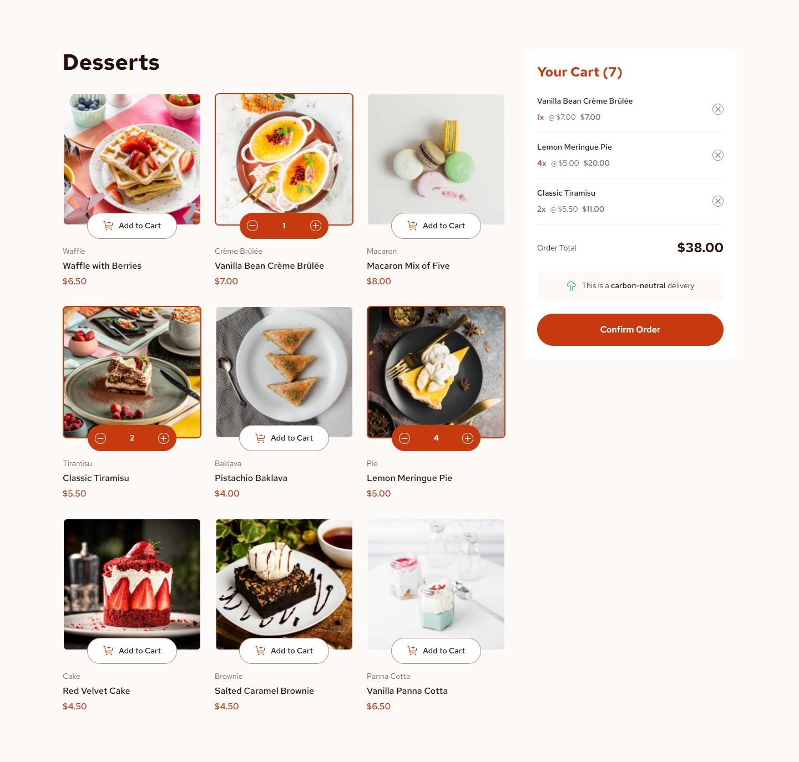
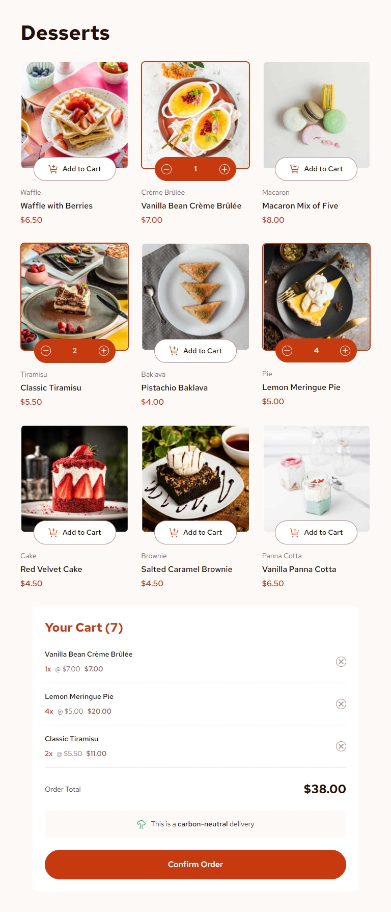
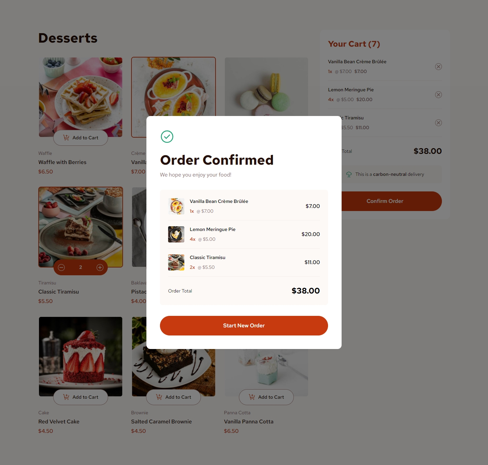

## Frontend Mentor Challenge 22 - Product List with Cart

This is my solution to the [Product List with Cart](https://www.frontendmentor.io/challenges/product-list-with-cart-5MmqLVAp_d) challenge on [Frontend Mentor](https://www.frontendmentor.io/).

#

### Links. 🔗

- Live Site URL: https://product-list-with-cart-darkstarxdd.vercel.app/

#

### Screenshots of the Solution (Desktop, Tablet & Confirmation Modal). 🔍

#

### Built with. 🔨

- React.
- Vanilla CSS (with CSS modules).
- Vite.

#

### Features. ✨

- User can add items to cart, control the quantity of items, remove items from cart.
- A confirmation modal is displayed when "Confirm Order" button is clicked.
- User can navigate and complete all actions using only the keyboard.

#

### Testing and Accessibility. 🧪

- Tested site usability with keyboard-only navigation.
- Used the Responsively App to check the site's appearance on various screen sizes, from 320x480 to 3000x2000.
- Set the browser font size on desktop to various values ranging from 9px to 72px to make sure everything on the site scales properly with the user's preferred browser font size.
- Zoomed the page in and out using Ctrl + Scroll wheel (up to 500%).
- Tested with the NVDA screen reader.
- Viewed the site on an iPhone 11 in both portrait and landscape modes.
- Performed Lighthouse and PageSpeed tests. ([PageSpeed Result.](https://pagespeed.web.dev/analysis/https-product-list-with-cart-darkstarxdd-vercel-app/x1qabh34am?form_factor=mobile))

#

### Tools I Use. 🔧

- [Prettier VS Code Extension](https://marketplace.visualstudio.com/items?itemName=esbenp.prettier-vscode) - Code formatter.

- [Responsively.app](https://responsively.app/) - A free and open source tool that allows you to test your webpage on different screen sizes, take screenshots and much more.

- [Google Webfonts Helper by Mario Ranftl](https://gwfh.mranftl.com/fonts) - Provides WOFF2 format for Google Fonts.

- [Color Contrast Checker by coolors.co](https://coolors.co/contrast-checker/112a46-acc8e5) - Check color contrast ratios and if needed, update the colors to match the WCAG guidelines.

#

- My Frontend Mentor Profile - [@DarkstarXDD](https://www.frontendmentor.io/profile/DarkstarXDD)
